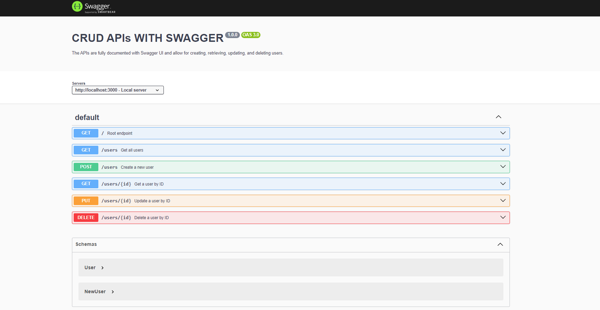

# TypeScript Node.js API Server with Swagger Documentation

This project is a simple RESTful API server built with Node.js and TypeScript. It includes CRUD operations for managing `users` and is documented using Swagger. The API is fully documented with Swagger UI and allows for creating, retrieving, updating, and deleting users.

<div style="text-align:center;margin:30px auto;">
  
</div>

## Features

- Node.js and Express-based API server
- TypeScript support for type safety
- CRUD operations (Create, Read, Update, Delete) for `users`
- Swagger documentation with YAML configuration
- In-memory data storage (no database integration)

## Getting Started

### Prerequisites

Make sure you have the following installed on your machine:

- [Node.js](https://nodejs.org/) (v14 or higher)
- [npm](https://www.npmjs.com/) (v6 or higher)

### Installation

1. Clone this repository:

   ```bash
   git clone (repo url)
   cd ts-node-swagger-api
   ```
2. Install the dependencies:

   ```bash
   npm install
   ```

### Running the Application
You can run the application in development mode with the following command:
```bash
npm runn dev
```

The server will be running at http://localhost:3000 and the Swagger UI for API documentation can be accessed at http://localhost:3000/api-docs.

## Available API Endpoints
- Base URL: http://localhost:3000
- GET /users - Retrieve all users
- GET /users/{id} - Retrieve a single user by ID
- POST /users - Create a new user
- PUT /users/{id} - Update a user by ID
- DELETE /users/{id} - Delete a user by ID


## Swagger Documentation
Swagger UI for this API is available at:

```bash
http://localhost:3000/api-docs
```

The Swagger documentation is written in YAML format and located in the root directory as swagger.yaml. It describes the API endpoints, request/response formats, and expected status codes.

## Scripts

npm run dev - Run the server in development mode using nodemon and ts-node
npm start - Run the server without development tools


## Technologies Used
Node.js
Express.js
TypeScript
Swagger (for API documentation)